# AlgoBoard

A comprehensive competitive programming statistics dashboard that aggregates and visualizes your performance across multiple programming platforms.

## 📸 Screenshots

<table>
  <tr>
    <td width="50%">
      <h3>Dashboard Overview</h3>
      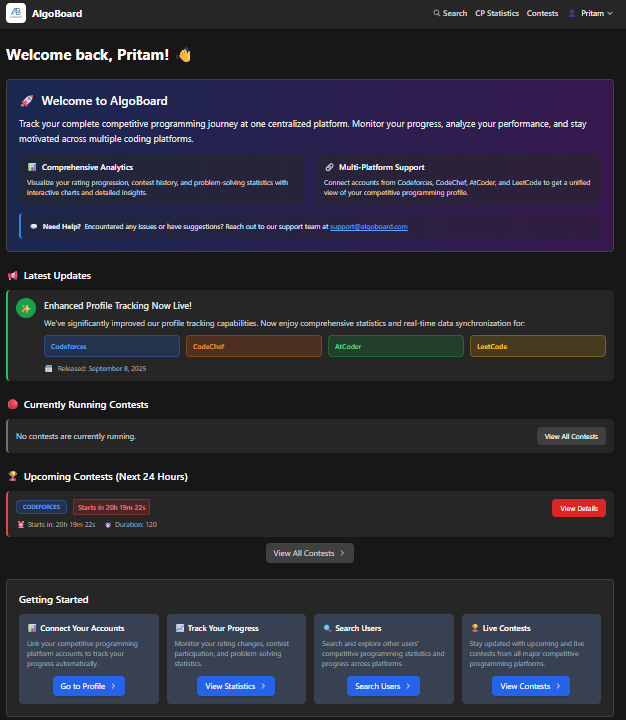
      <i>Main dashboard showing all connected platforms</i>
    </td>
    <td width="50%">
      <h3>Profile Management</h3>
      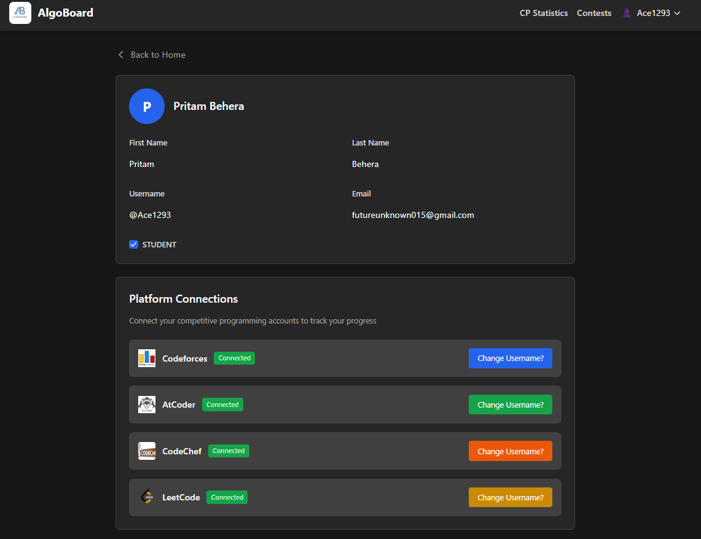
      <i>User profile and platform connection management</i>
    </td>
  </tr>
  <tr>
    <td width="50%">
      <h3>Contest Announcements</h3>
      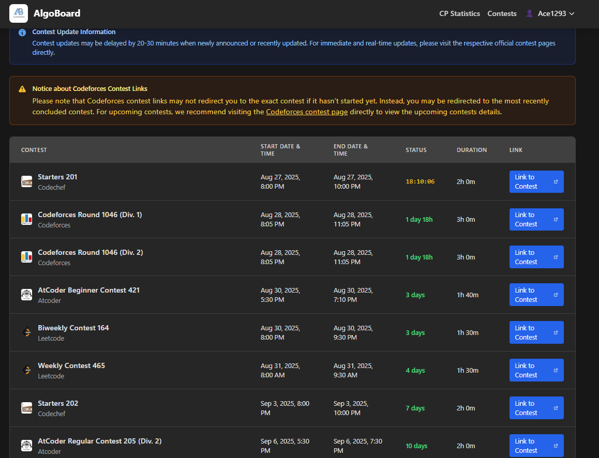
      <i>Latest contest announcements and upcoming events</i>
    </td>
    <td width="50%">
      <h3>All Platforms Statistics</h3>
      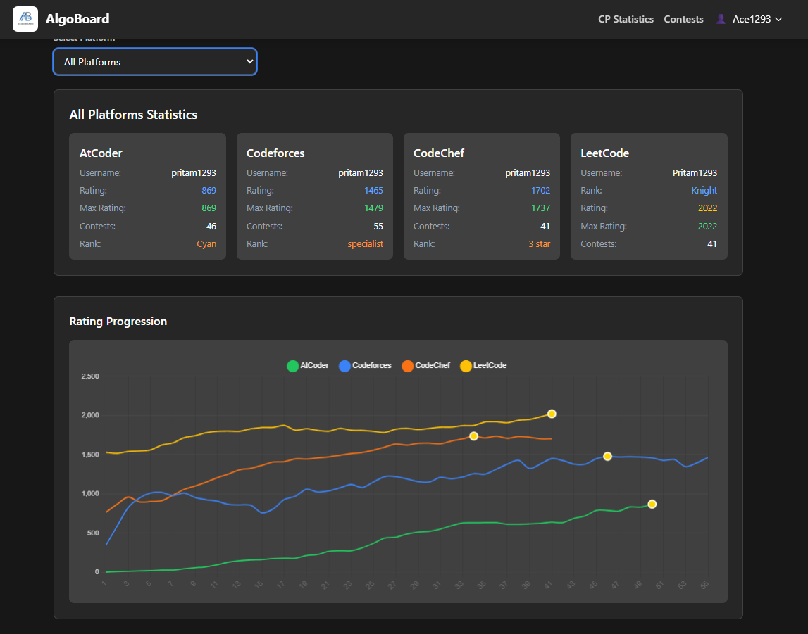
      <i>Unified view of statistics across all connected platforms</i>
    </td>
  </tr>
</table>

### Platform-Specific Views

<table>
  <tr>
    <td width="50%">
      <h4>Codeforces Overview</h4>
      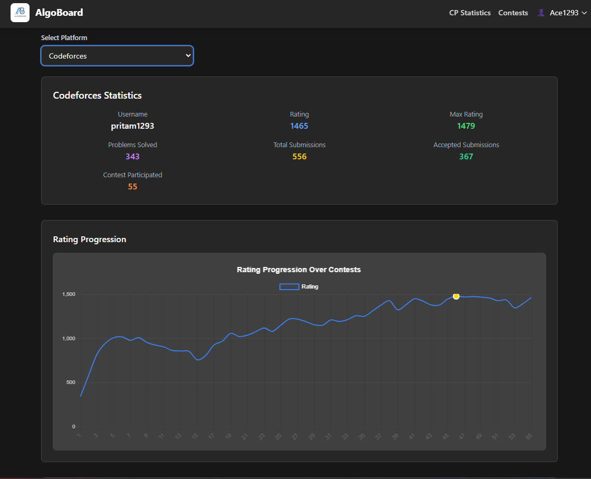
    </td>
    <td width="50%">
      <h4>Codeforces Details</h4>
      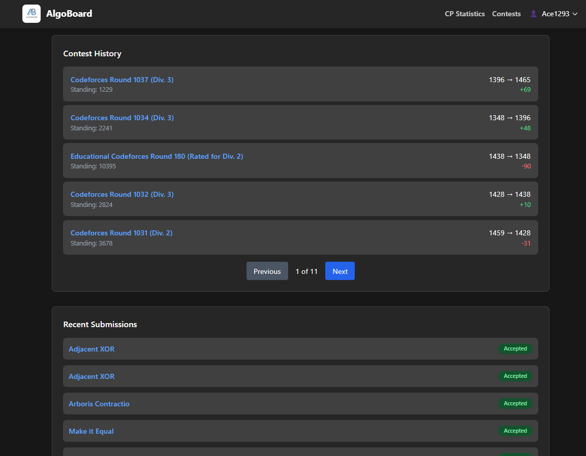
    </td>
  </tr>
  <tr>
    <td width="50%">
      <h4>LeetCode Overview</h4>
      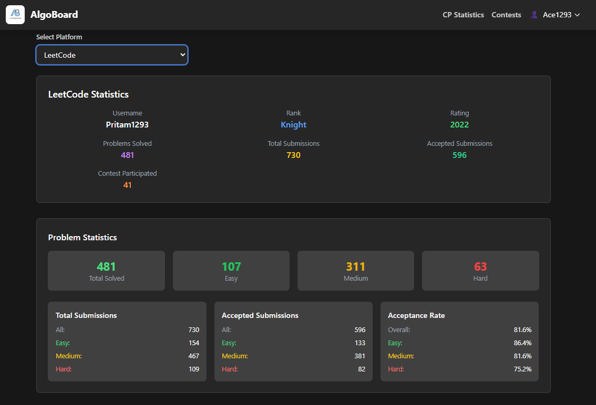
    </td>
    <td width="50%">
      <h4>LeetCode Progress</h4>
      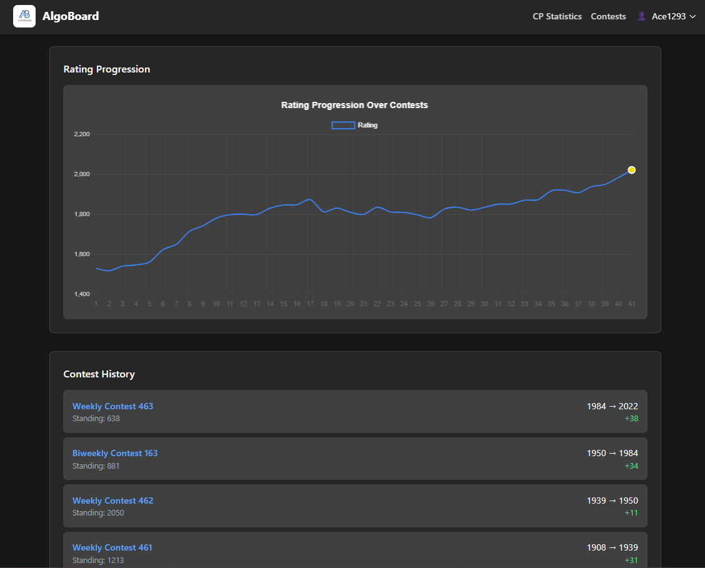
    </td>
  </tr>
  <tr>
    <td width="50%">
      <h4>CodeChef Graph</h4>
      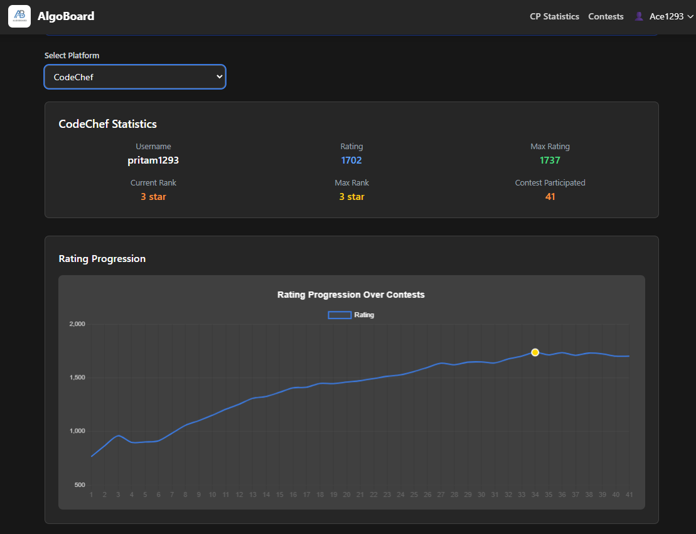
    </td>
    <td width="50%">
      <h4>CodeChef History</h4>
      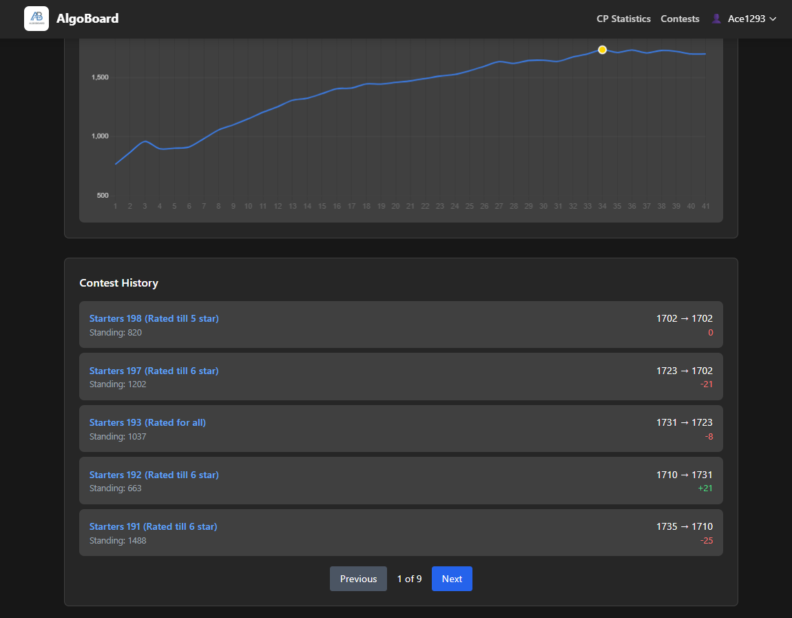
    </td>
  </tr>
  <tr>
    <td width="50%">
      <h4>AtCoder Graph</h4>
      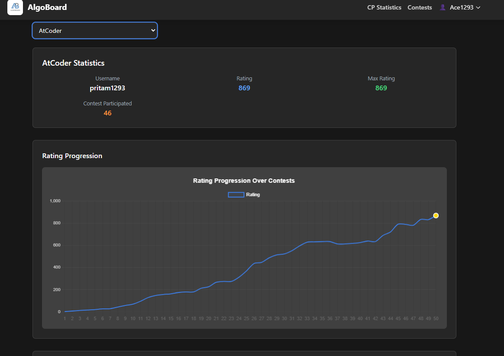
    </td>
    <td width="50%">
      <h4>AtCoder History</h4>
      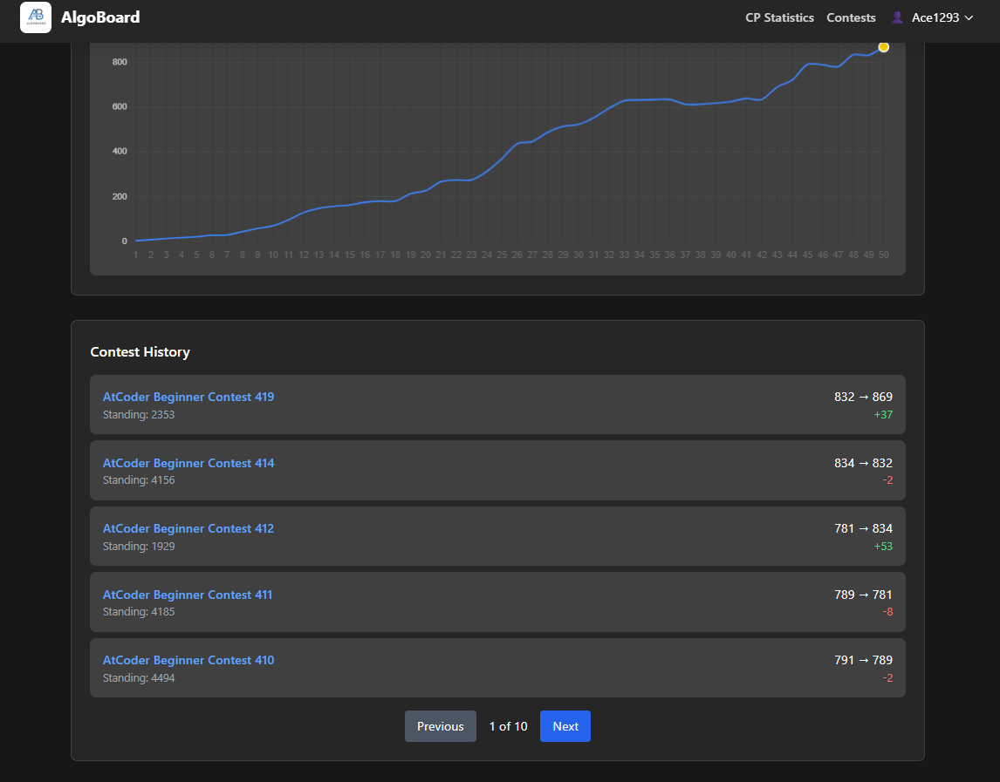
    </td>
  </tr>
</table>

## 📚 Table of ContentsoBoard

A comprehensive competitive programming statistics dashboard that aggregates and visualizes your performance across multiple programming platforms.

## � Table of Contents

- [Features](#-features)
- [Technology Stack](#️-technology-stack)
- [What This Project Accomplishes](#-what-this-project-accomplishes)
- [Technical Implementation](#-technical-implementation)
- [Problem Solved](#-problem-solved)
- [Getting Started](#-getting-started)
- [Usage](#-usage)
- [Future Enhancements](#-future-enhancements)
- [Developer](#-developer)
- [License](#-license)
- [Contributing](#-contributing)
- [Support](#-support)

## �🚀 Features

### Multi-Platform Integration

- **Codeforces**: Rating progression, contest history, recent submissions
- **LeetCode**: Problem statistics, submission history, rating tracking
- **AtCoder**: Contest participation and rating analysis
- **CodeChef**: Performance metrics and contest results

### Data Visualization

- **Rating Progression Charts**: Interactive line charts showing rating changes over time
- **Contest History**: Detailed view of contest participation with performance analysis
- **Recent Submissions**: Latest problem submissions with status indicators
- **All Platforms View**: Superimposed rating progression across all connected platforms

### User Experience

- **Real-time Data**: Automatic profile updates with caching for optimal performance
- **Responsive Design**: Works seamlessly on desktop and mobile devices
- **Interactive Elements**: Clickable contest names and problem links
- **Status Indicators**: Color-coded submission statuses and rating changes

## 🛠️ Technology Stack

### Backend

- **Java Spring Boot**: RESTful API development
- **Spring Security**: Authentication and authorization
- **Spring Cache**: Intelligent caching for API responses
- **Spring Scheduler**: Automated profile data refresh
- **Maven**: Dependency management

### Frontend

- **React.js**: Component-based UI development
- **Chart.js**: Interactive data visualization
- **Tailwind CSS**: Responsive styling and design
- **React Router**: Client-side routing

### Architecture

- **RESTful API**: Clean separation between frontend and backend
- **Caching Strategy**: Hourly data refresh for optimal performance
- **Responsive Design**: Mobile-first approach with Tailwind CSS

### Database

- **MongoDB**: NoSQL document database for flexible data storage
- **Spring Data MongoDB**: MongoDB integration with Spring Boot
- **Document-based Storage**: User profiles, platform connections, and cached statistics
- **Flexible Schema**: Easy adaptation to different platform data structures

## 📊 What This Project Accomplishes

### 1. **Unified Dashboard**

Instead of checking multiple platforms separately, users can view all their competitive programming statistics in one place.

### 2. **Performance Tracking**

- Track rating progression across different platforms
- Analyze contest performance patterns
- Monitor submission statistics and success rates

### 3. **Data Aggregation**

- Fetches data from multiple competitive programming APIs
- Normalizes different data formats into a consistent interface
- Provides comparative analysis across platforms

### 4. **Interactive Visualizations**

- Dynamic charts showing rating progression over time
- Color-coded status indicators for easy interpretation
- Hover tooltips with detailed contest information

## 🔧 Technical Implementation

### Backend Services

- **UserService**: Core business logic for user management and data aggregation
- **Platform Services**: Individual services for each competitive programming platform
- **Caching Layer**: Intelligent caching to reduce API calls and improve performance
- **Scheduled Tasks**: Automatic data refresh every hour

### Frontend Components

- **Dashboard**: Main landing page with platform overview
- **CPStatistics**: Detailed statistics view with platform selection
- **Chart Components**: Reusable visualization components
- **Authentication**: Secure user login and profile management

### Key Features Implemented

1. **Multi-platform data fetching** with parallel API calls
2. **Interactive rating progression charts** with peak highlighting
3. **Clickable contest history** with direct links to contests
4. **Recent submissions tracking** with status formatting
5. **Responsive design** that works on all devices
6. **Intelligent caching** for optimal performance

## 🎯 Problem Solved

### Before AlgoBoard:

- Users had to visit multiple websites to check their competitive programming progress
- No unified view of performance across different platforms
- Difficult to compare ratings and progress between platforms
- No centralized tracking of contest participation

### After AlgoBoard:

- **Single Dashboard**: All competitive programming statistics in one place
- **Comparative Analysis**: Easy comparison of performance across platforms
- **Progress Tracking**: Visual representation of improvement over time
- **Quick Access**: Direct links to contests and problems
- **Performance Insights**: Detailed analytics of submission patterns

## 🚀 Getting Started

### Prerequisites

- Java 11 or higher
- Node.js 14 or higher
- Maven 3.6 or higher

### Backend Setup

```bash
# Clone the repository
git clone https://github.com/pritam1293/AlgoBoard.git
cd AlgoBoard

# Run the Spring Boot application
./mvnw spring-boot:run
```

### Frontend Setup

```bash
# Navigate to frontend directory
cd frontend

# Install dependencies
npm install

# Start the development server
npm start
```

## 📱 Usage

1. **Sign Up/Login**: Create an account or login to your existing account
2. **Connect Platforms**: Link your competitive programming platform usernames
3. **View Dashboard**: See an overview of all your connected platforms
4. **Detailed Analysis**: Click on individual platforms for detailed statistics
5. **Track Progress**: Monitor your rating progression and contest performance

## 🔮 Future Enhancements

- **More Platforms**: Integration with additional competitive programming sites
- **Advanced Analytics**: Performance predictions and trend analysis
- **Social Features**: Compare performance with friends
- **Mobile App**: Native mobile application
- **Export Features**: Download statistics as PDF reports

## 👨‍💻 Developer

**Pritam** - Full Stack Developer passionate about competitive programming and data visualization.

## 🤝 Contributing

Contributions are welcome! Please feel free to submit a Pull Request.

## 📞 Support

If you have any questions or need support, please open an issue in the GitHub repository.

---

_Built with ❤️ for the competitive programming community_
